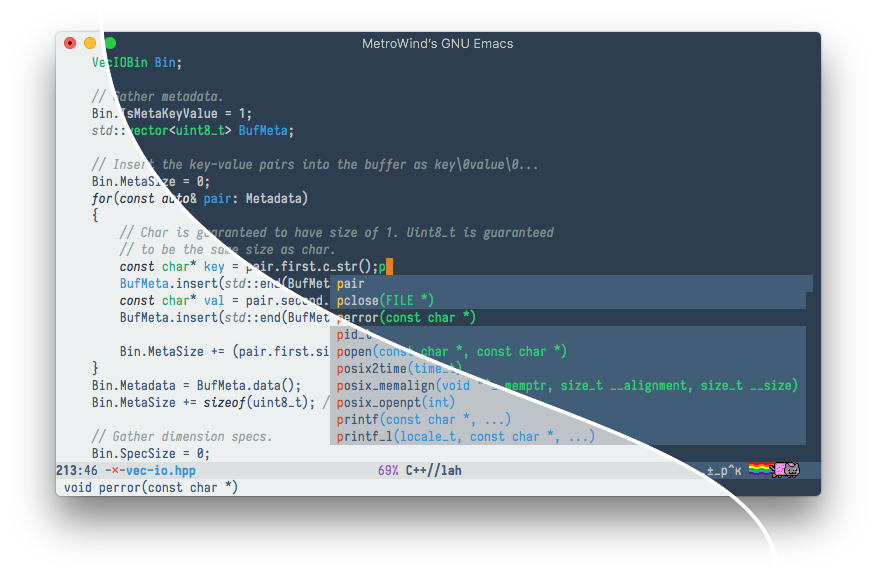

# Fluc UI Theme for Emacs

Inspired by the color scheme provided at http://flatuicolors.com. This
theme is for GNU Emacs version 24+, in which theming is officially
supported.

Both light and dark style are included.

## Screenshot

Note: Nyan cat not included :-p

## Installation

Install `flucui-themes` from Melpa, and call
`(flucui-themes-load-style 'light)` (or `'dark`) to activate the
theme. The function `flucui-themes-switch-style` can be used to toggle
between light and dark variant.

If you want to install manually, copy the `flucui-*-theme.el` files to
somewhere in your Emacs `custom-theme-load-path`. Then either `M-x
load-theme<RET>flucui-light` or `(load-theme 'flucui-light t)`. Use
`-dark` for the dark style.

The `other` directory contains the color setting for some other
programs.
